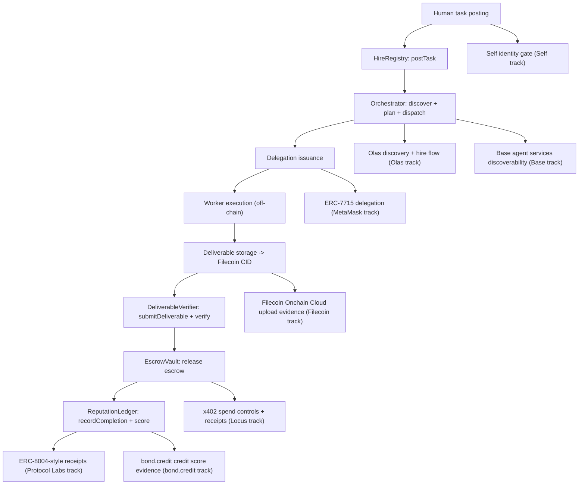

# HireChain Integration Plan (Synthesis Prize Partners)

## Confidentiality
- Do not include private keys, API keys, or tokens in this document.
- If you need to refer to secrets, reference them only via environment variable names (never values).

## 1) Current state (what already works)

### System overview
HireChain is an autonomous agent-to-agent labor market on Base:
1. A human posts a task to `HireRegistry`.
2. The orchestrator decomposes tasks into subtasks.
3. Workers bid on-chain; the poster accepts a bid.
4. The orchestrator issues scoped delegations to the worker.
5. A worker submits a deliverable CID; `DeliverableVerifier` checks it matches an expected hash.
6. On verification, `EscrowVault` releases escrow to the worker.
7. `ReputationLedger` records completion and produces a score.

Existing repo artifacts that define the core lifecycle:
- Architecture summary: `README.md`
- Orchestrator: `agent/orchestrator.js`
- On-chain lifecycle integration test: `agent/integration-test.js` (+ `agent/integration-test-part2.js`, `agent/finish-test.js`)
- Smart contracts:
  - `src/HireRegistry.sol`
  - `src/EscrowVault.sol`
  - `src/DeliverableVerifier.sol`
  - `src/ReputationLedger.sol`
  - `src/DelegationModule.sol`

### Deployed contract addresses (Base Sepolia)
From `README.md`, contracts deployed on Base Sepolia:
- `EscrowVault`: `0xeB476f3c54c4565131dFa76b2ecB044Ddb521f5e`
- `HireRegistry`: `0x5B82099ecbDC6431B6770a7184c31E3471B9CaaC`
- `DeliverableVerifier`: `0x9b498f9D32E5e98674A0B26A67194F48C222A9d1`
- `ReputationLedger`: `0xfAA6447C4216681483240Df65243A16F905964b3`
- `DelegationModule`: `0x1f6679eC215fF9ca182A9B2c540E62440c33342d`

### Proof of integration (8-step on-chain lifecycle)
From `README.md`, the lifecycle succeeded on-chain with real transactions (Base Sepolia), in order:
1. `postTask`: `0x6f0742a5a86fd306beef766903d722f8361d71ec833d8e7c7bb55a88f27607b0`
2. `setExpectedHash`: `0xa649ef880bc09adcd0ab75bccbd6d0ec4d7d028d948738a0b63bd26f4eb5865b`
3. `submitBid`: `0x8dcdfe991a704c5119baf95f5f98ea2d58004ef66e877b4ea419116ac1633ef1`
4. `acceptBid`: `0x0dcd98f95ebc11a9d459246d3870d8f7585e07d2e14ded1ec4f655467a5c65bd`
5. `issueDelegation`: `0x5134ec32a369104135b4326843b2b2bdf9bbfa5d16be4fc49c2edac9ed829dbe`
6. `createSubtask`: `0x43ab8f89a66a6aa238f399416a0a6e0c2c44a4e9765dd294e413423adf696269`
7. `submitDeliverable`: (listed as the step that triggers CID verification + escrow auto-release)
8. `recordCompletion`: `0x0d39da09d04c1f389d89ee0c53087a34d018fbc2c4a6ac4f839bd450a3a325ef`

### What “partner integrations” mean today
Some items in the current codebase are already aligned conceptually (e.g., hash-based deliverable verification and CID submission flow), but sponsor-specific integrations like x402-native payment routing or ERC-7715 permissioning are not yet wired to the exact sponsor frameworks.

This document provides an integration plan that makes sponsor-specific requirements verifiable via tests, tx receipts, and evidence artifacts.

## 2) Target partner list (8 prize tracks)
These are the 8 partner sponsors/tracks targeted, using the official catalog prize names.

Source: `https://synthesis.devfolio.co/catalog/prizes.md`

1. Protocol Labs
Track name: `Agents With Receipts — ERC-8004`

2. MetaMask
Track name: `Best Use of Delegations`

3. Locus
Track name: `Best Use of Locus`

4. Base
Track name: `Agent Services on Base`

5. Olas
Track name: `Hire an Agent on Olas Marketplace`

6. Filecoin Foundation
Track name: `Best Use Case with Agentic Storage`

7. bond.credit
Track name: `Agents that pay`

8. Self
Track name: `Best Self Agent ID Integration`

## 3) System integration map (where each sponsor fits)

## 4) Contract inventory (what to change, and how to minimize churn)

### Current core contracts
The current HireChain contracts are:
- `src/HireRegistry.sol`
- `src/EscrowVault.sol`
- `src/DeliverableVerifier.sol`
- `src/ReputationLedger.sol`
- `src/DelegationModule.sol`

### Sponsor-specific contract-change targets
This is a plan-level “inventory” used to decide what must change on-chain versus what can remain off-chain.

Protocol Labs (`Agents With Receipts — ERC-8004`)
- Primary on-chain target: `src/ReputationLedger.sol` (or a receipts adapter contract)
- Why: convert completion history into verifiable, receipts-style artifacts aligned with ERC-8004 expectations.

MetaMask (`Best Use of Delegations`)
- Primary on-chain target: `src/DelegationModule.sol` (or a delegation adapter contract)
- Why: permissioning must map to the MetaMask ERC-7715 model so that granted permissions are the basis for allowed execution.

Locus (`Best Use of Locus`)
- Primary on-chain target: `src/EscrowVault.sol` (or a payment adapter contract)
- Why: replace or augment ETH escrow settlement so that spend controls and auditability are demonstrated via x402-native payment intents/settlement flow.

Base (`Agent Services on Base`)
- Primary on-chain target: likely minimal, mostly discoverability artifacts off-chain
- Why: make the service discoverable and demonstrate execution with the payment model expected by the Base track.

Olas (`Hire an Agent on Olas Marketplace`)
- Primary on-chain target: likely minimal
- Why: orchestrator can select a worker via Olas and then use the existing on-chain assignment flow.

Filecoin Foundation (`Best Use Case with Agentic Storage`)
- Primary on-chain target: likely minimal
- Why: contracts can remain hash-based, but off-chain storage integration must generate a real CID/pieceCID and prove consistency end-to-end.

bond.credit (`Agents that pay`)
- Primary on-chain target: likely add a credit adapter contract or event-based integration module
- Why: ensure a verified on-chain credit score update path exists and is tied to receipts/outcomes.

Self Protocol (`Best Self Agent ID Integration`)
- Primary on-chain target: an identity gating module or a check in delegation/bid acceptance flow
- Why: block delegation/hiring until identity verification state is satisfied.

### Deployment strategy (plan-level)
To reduce issues caused by many contract deployments:
- Prefer one deployment (or upgrade) that includes all required contract-level changes identified above.
- Use upgradeable proxy patterns only when stable addresses are required for evidence and sponsor demos.
- Keep sponsor-specific wiring mostly off-chain (agent/orchestrator) where possible.

## 5) Sponsor-by-sponsor integration plan

The goal for each sponsor is to make a “winning-level” integration verifiable via:
- repo changes (code)
- tests (unit + lifecycle)
- receipts/tx hashes and evidence artifacts (outputs)
- a sponsor-specific demo workflow

### 5.1 Protocol Labs — ERC-8004 receipts (`Agents With Receipts — ERC-8004`)

Winning-level integration criteria
- Completion outcomes generate receipts-style artifacts that demonstrate trustless verification aligned with ERC-8004 expectations.

What to build/change
- Add or refactor a receipts/validation layer:
  - connect orchestration completion to receipt artifacts
  - ensure receipt artifacts can be validated from on-chain events/tx receipts
- Extend tests to assert that receipts artifacts are produced at completion time.

Repo touchpoints (expected)
- `src/ReputationLedger.sol` (or add a receipts adapter)
- `agent/orchestrator.js` (emit/produce receipt metadata)
- `agent/integration-test.js` (assert receipt outputs)

Confirm-working test/evidence checklist
- `forge test -v` passes
- `cd agent && npm install && node integration-test.js` produces:
  - successful completion evidence
  - receipts outputs that can be correlated to tx logs/receipts

New evidence to collect after integration
- tx hash for the completion that includes receipt/validation logs
- a local evidence file (e.g., JSON) containing receipt metadata generated during orchestration

### 5.2 MetaMask — ERC-7715 delegations (`Best Use of Delegations`)

Winning-level integration criteria
- Permissioning is granted via MetaMask’s ERC-7715 model and execution is scoped by those granted permissions.

What to build/change
- Replace or wrap the current delegation issuance so that:
  - a MetaMask permission grant is the basis for delegated execution
  - allowed selectors/spend caps enforced by the system are demonstrably derived from the granted permissions

Repo touchpoints (expected)
- `src/DelegationModule.sol` (or adapter)
- `agent/` integration module for ERC-7715 permission grant flow
- `agent/orchestrator.js` (request permissions + execute under scope)

Confirm-working test/evidence checklist
- `forge test -v` passes
- on-chain lifecycle smoke still completes end-to-end
- sponsor demo evidence exists showing permission grant + scoped execution correlation

New evidence to collect after integration
- tx hash for delegation issuance tied to the granted permissions model
- evidence artifact showing “granted permissions -> allowed actions -> executed actions”

### 5.3 Locus — x402-native payments (`Best Use of Locus`)

Winning-level integration criteria
- Spend controls and auditability demonstrate x402-native payment behavior (not only raw ETH transfers).

What to build/change
- Add an x402 payment/intents integration module in `agent/`.
- Update settlement so spending/escrow release produces auditable receipts correlated to x402 settlement.

Repo touchpoints (expected)
- `src/EscrowVault.sol` (or add payment adapter)
- `agent/` x402 module for creating intents and handling settlement flow
- integration scripts to produce a verifiable audit trail

Confirm-working test/evidence checklist
- unit tests pass
- lifecycle smoke passes and logs contain x402 evidence artifacts
- at least one payment intent flow is exercised and produces receipts in the evidence folder

New evidence to collect after integration
- tx hash(es) related to payment settlement and release
- x402 evidence artifact(s) from the payment layer

### 5.4 Base — agent services discoverability (`Agent Services on Base`)

Winning-level integration criteria
- HireChain is discoverable as an agent service and demonstrates payment-aligned execution under the Base track expectations.

What to build/change
- Add minimal service registration/discovery artifact required by the Base track.
- Ensure the service execution flow is still verifiable end-to-end.

Repo touchpoints (expected)
- off-chain service descriptor files (where applicable)
- `agent/orchestrator.js` integration outputs for the Base demo

Confirm-working test/evidence checklist
- unit tests pass
- on-chain lifecycle passes
- a discoverability/evidence artifact exists (screenshot or CLI output)

New evidence to collect after integration
- service descriptor identifier(s)
- evidence that calling the service triggers the expected on-chain lifecycle

### 5.5 Olas — hire flow (`Hire an Agent on Olas Marketplace`)

Winning-level integration criteria
- Orchestrator performs real Olas discovery and hires a worker via Olas marketplace flows.

What to build/change
- Implement an Olas discovery/hiring module used by the orchestrator.
- Map selected Olas worker to the on-chain worker address used by HireChain assignment.

Repo touchpoints (expected)
- `agent/olas-*` module (new)
- `agent/orchestrator.js` (worker selection logic)

Confirm-working test/evidence checklist
- unit tests pass
- lifecycle smoke passes using an Olas-selected worker identity/address
- recorded Olas discovery/hire response IDs exist in evidence

New evidence to collect after integration
- Olas discovery response IDs
- the resulting worker address used in the on-chain assignment flow

### 5.6 Filecoin Foundation — agentic storage (`Best Use Case with Agentic Storage`)

Winning-level integration criteria
- Deliverables are actually uploaded using Filecoin Onchain Cloud and CID/pieceCID consistency is proven end-to-end.

What to build/change
- Implement real Filecoin Onchain Cloud upload in the deliverable generation path.
- Ensure the produced CID/pieceCID:
  - is used in `submitDeliverable` (or its expected hash calculation)
  - matches the verifier’s expectations

Repo touchpoints (expected)
- `agent/` storage module (new)
- `agent/integration-test.js` (generate CID via Filecoin upload in the supported environment)
- `src/DeliverableVerifier.sol` (only if verifier needs additional metadata compatibility)

Confirm-working test/evidence checklist
- unit tests pass
- on-chain lifecycle passes where CID is produced by Filecoin upload
- evidence includes upload response identifiers and the CID used on-chain

New evidence to collect after integration
- upload response identifiers
- CID used for `submitDeliverable`
- verifier events/log evidence correlating CID hash verification

### 5.7 bond.credit — credit integration (`Agents that pay`)

Winning-level integration criteria
- Completed outcomes trigger a bond.credit credit scoring flow that results in an on-chain verifiable credit score tied to ERC-8004 identity/receipts.

What to build/change
- Add an integration module in `agent/` that triggers the credit scoring path required by bond.credit.
- Ensure the resultant credit update is verifiable on-chain.

Repo touchpoints (expected)
- `agent/credit-*` integration module (new)
- optional on-chain adapter contract (if bond.credit requires it)
- test harness updates to capture the credit score update tx hash/state

Confirm-working test/evidence checklist
- unit tests pass
- lifecycle passes
- evidence shows the credit request + resulting on-chain state update

New evidence to collect after integration
- tx hash for the credit score update (or equivalent on-chain artifact)
- state evidence showing the credit score updated tied to the agent identity

### 5.8 Self Protocol — agent identity gate (`Best Self Agent ID Integration`)

Winning-level integration criteria
- Self Protocol ZK identity verification is load-bearing:
  - delegation/hiring is blocked until verification state is satisfied
  - verification configuration and resulting behavior are demonstrable.

What to build/change
- Add an identity gate module (contract or enforced orchestration rule) that blocks:
  - delegation issuance
  - bidding/assignment
  - or any other sponsor-demonstrated gating step
- Integrate Self verification flow such that:
  - evidence can be correlated to the gating behavior

Repo touchpoints (expected)
- orchestration gating: `agent/orchestrator.js`
- on-chain gating: likely additions around `DelegationModule` or `HireRegistry` acceptance logic

Confirm-working test/evidence checklist
- unit tests pass
- lifecycle passes only when identity gate is satisfied
- evidence includes:
  - verification config/identifier
  - tx hashes demonstrating the gating behavior

New evidence to collect after integration
- tx hash(es) showing blocked vs allowed behavior
- evidence outputs tying Self verification to the gate decision

## 6) Evidence checklist (consolidated)

### Existing evidence you can reuse
- Contract sources:
  - `src/HireRegistry.sol`
  - `src/EscrowVault.sol`
  - `src/DeliverableVerifier.sol`
  - `src/ReputationLedger.sol`
  - `src/DelegationModule.sol`
- Orchestrator:
  - `agent/orchestrator.js`
- Unit tests:
  - `test/HireChain.t.sol`
- On-chain lifecycle:
  - the 8-step tx list in `README.md` (tx links)
  - `agent/integration-results.json`

### New evidence to add per sponsor
- Protocol Labs (ERC-8004 receipts):
  - tx hash for the completion/receipt write that contains the receipt-style event/log
  - evidence artifact that maps “completion step -> receipt -> tx hash”
- MetaMask (ERC-7715 delegation):
  - tx hash for delegation issuance (on-chain) that references the granted permission scope
  - evidence artifact showing “permission grant response -> delegated selector set -> executed calls”
- Locus (x402 spend + receipts):
  - tx hash for the spend/settlement action that represents x402-based settlement (or the tx that Locus settlement confirms)
  - x402 receipt artifact (or receipt identifier) correlated to the on-chain settlement tx hash
- Base (agent services discoverability):
  - service descriptor identifier(s) produced by the Base service registration/discovery flow
  - tx hash for the service execution that triggers `HireRegistry.postTask` (or the equivalent entrypoint)
- Olas (hire an agent on Olas):
  - Olas discovery/hire response identifier(s)
  - tx hash for on-chain worker assignment, typically the `HireRegistry.acceptBid` tx that uses the Olas-selected worker address
- Filecoin Foundation (agentic storage):
  - upload response identifiers from Filecoin Onchain Cloud (pieceCid/data cid identifiers)
  - tx hash for `DeliverableVerifier.submitDeliverable` using the CID (or cid hash) derived from the upload output
- bond.credit (agents that pay):
  - tx hash for the credit score update on-chain that corresponds to completed work
  - evidence artifact showing “agent identity (ERC-8004) -> credit score -> tx hash”
- Self (identity gating):
  - tx hash for a gated action that fails before verification and succeeds after verification (if the system uses enforced on-chain gating)
  - evidence artifact that records the verification config/id used for the run and correlates it to the allow/deny behavior

## 7) Partner outreach plan (maximize likelihood of partner money)
No partner can be guaranteed to “definitely” fund you, but you can maximize expected payout probability by targeting sponsors whose success criteria are most directly served by verifiable artifacts you can show.

### Recommended outreach priority (highest likelihood first)
1. Protocol Labs
2. MetaMask
3. Locus
4. Filecoin Foundation
5. bond.credit
6. Self Protocol
7. Base
8. Olas

### Sponsor-specific “why us” positioning (template)
Protocol Labs
Ask: request review of your ERC-8004-aligned receipts and confirm they are evidence-complete for judge scoring.

MetaMask
Ask: request focus on your ERC-7715 permissioning integration and a sponsor demo slot.

Locus
Ask: request verification that your spend controls + audit receipts demonstrate x402-native behavior.

Filecoin Foundation
Ask: request validation of end-to-end upload + CID consistency as the storage “proof of work”.

bond.credit
Ask: request confirmation that your credit score update path is on-chain verifiable and tied to agent outcomes.

Self Protocol
Ask: request evidence review that identity verification is load-bearing and blocks restricted flows.

Base
Ask: request confirmation your agent service is discoverable and demonstrates payments as expected.

Olas
Ask: request validation that worker hiring is truly from Olas discovery and used in on-chain assignment.

## 8) Timeline (practical)
- Phase A: contract inventory + one deployment (or controlled upgrades) to support sponsor requirements
- Phase B: per sponsor integration module (agent/orchestrator + tests) with evidence outputs
- Phase C: sponsor review package assembly (README + tx links + demo steps + evidence files)

